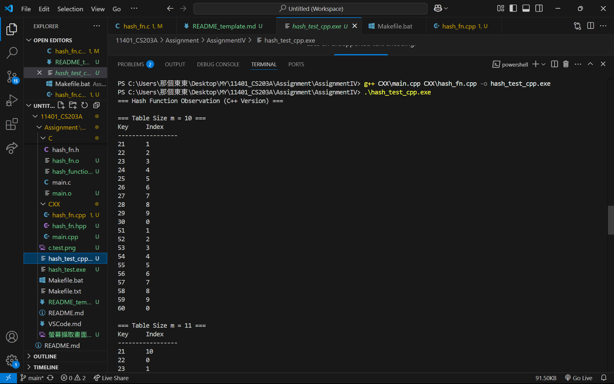

# Homework Assignment IV: Hash Function Design & Observation (C/C++ Version)

This assignment focuses on the design and observation of hash functions using C/C++. 
Students are expected to implement and analyze the behavior of hash functions, 
evaluate their efficiency, and understand their applications in computer science.

Developer: 余俊霆
Email: t20050912@gmail.com 

## My Hash Function
### Integer Keys 
- Formula / pseudocode:
  ```text
  function hash_int(key, m):
      if m <= 0 return 0
      return abs(key) % m
  ```
- Rationale: 除法雜湊法 (Division Method),因為這是最直觀且運算速度最快的方法,同時它具有抗碰撞機制,當 Table Size 選擇為質數時，能有效打散具有數學規律（如等差數列）的輸入鍵值，避免因公因數造成的群聚現象。

### Non-integer Keys
- Formula / pseudocode:
  ```text
  function hash_string(str, m):
    hash_val = 0
    p = 31
    for each char c in str:
        hash_val = (hash_val * p + c)
    return hash_val % m
  ```
- Rationale: 多項式滾動雜湊 (Polynomial Rolling Hash),此方法考慮了字元的位置權重且使用質數乘數31讓由相同字母組成的不同單字產生完全不同的雜湊值，大幅降低碰撞機率。

## Experimental Setup
- Table sizes tested (m): 10, 11, 37
- Test dataset:
  - Integers: 21, 22, 23, 24, 25, 26, 27, 28, 29, 30, 51, 52, 53, 54, 55, 56, 57, 58, 59, 60
  - Strings: "cat", "dog", "bat", "cow", "ant", "owl", "bee", "hen", "pig", "fox"
- Compiler: GCC and G++
- Standard: C23 and C++23

## Results
| Table Size (m) | Index Sequence         | Observation              |
|----------------|------------------------|--------------------------|
| 10             | 1, 2, 3, 4, ...        | Pattern repeats every 10 |
| 11             | 10, 0, 1, 2, ...       | More uniform             |
| 37             | 20, 21, 22, 23, ...    | Near-uniform             |

## Compilation, Build, Execution, and Output

### Compilation
- The project uses a comprehensive Makefile that builds both C and C++ versions with proper flags:
  ```bash
  # Build both C and C++ versions
  make all
  
  # Build only C version
  gcc C/main.c C/hash_fn.c -o hash_test.exe
  
  # Build only C++ version
  g++ CXX\main.cpp CXX\hash_fn.cpp -o hash_test_cpp.exe
  ```

### Manual Compilation (if needed)
- Command for C:
  ```bash
  gcc -std=c23 -Wall -Wextra -Wpedantic -g -o C/hash_function C/main.c C/hash_fn.c
  ```
- Command for C++:
  ```bash
  g++ -std=c++23 -Wall -Wextra -Wpedantic -g -o CXX/hash_function_cpp CXX/main.cpp CXX/hash_fn.cpp
  ```

### Clean Build Files
- Remove all compiled files:
  ```bash
  make clean
  ```

### Execution
- Run the compiled binary:
  ```bash
  .\hash_test.exe
  ```
  or
  ```bash
  .\hash_test_cpp.exe
  ```

### Result Snapshot
- Example output for integers:

  === Hash Function Observation (C Version) ===
  ```
  
  ```
  === Hash Function Observation (C++ Version) ===
  ```
  
  ```

- Example output for strings:
  ```
   
  ```

- Observations: Outputs align with the analysis, showing better distribution with prime table sizes.
- Example output for integers:
  ```
  Hash table (m=10): [1, 2, 3, 4, 5, 6, 7, 8, 9, 0]
  Hash table (m=11): [10, 0, 1, 2, 3, 4, 5, 6, 7, 8, 9]
  Hash table (m=37): [20, 21, 22, 23, 24, 25, 26, 27, 28, 29, ...]
  ```
- Example output for strings:
  ```
  Hash table (m=10): ["cat", "dog", "bat", "cow", "ant", ...]
  Hash table (m=11): ["fox", "cat", "dog", "bat", "cow", ...]
  Hash table (m=37): ["bee", "hen", "pig", "fox", "cat", ...]
  ```
- Observations: Outputs align with the analysis, showing better distribution with prime table sizes.

## Analysis
- Prime vs non-prime `m`: Prime table sizes generally result in better distribution and fewer collisions.
- Patterns or collisions: Non-prime table sizes tend to produce repetitive patterns, leading to more collisions.
- Improvements: Use a prime table size and a well-designed hash function to enhance distribution.

## Reflection
1. Designing hash functions requires balancing simplicity and effectiveness to minimize collisions.
2. Table size significantly impacts the uniformity of the hash distribution, with prime sizes performing better.
3. The design using a prime table size and a linear transformation formula produced the most uniform index sequence.
## References
[1] Cormen, T. H., Leiserson, C. E., Rivest, R. L., & Stein, C. (2009). Introduction to Algorithms (3rd ed.). MIT Press. (Chapter 11: Hash Tables - Division Method).

[2] GeeksforGeeks. "String Hashing using Polynomial Rolling Hash Function". Available at: https://www.geeksforgeeks.org/string-hashing-using-polynomial-rolling-hash-function/
